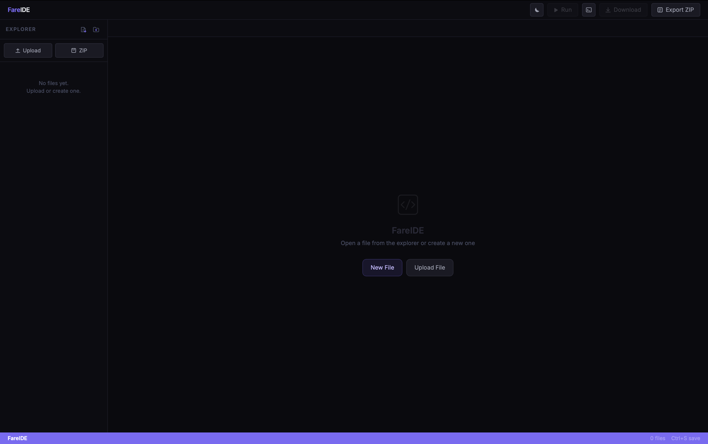

# FareIDE

FareIDE adalah aplikasi desktop untuk menulis dan menjalankan kode, dibangun
dengan Tauri, React, dan CodeMirror. Berbeda dari kebanyakan online IDE yang
mensimulasikan bahasa pemrograman di dalam browser, FareIDE menjalankan kode
secara langsung menggunakan compiler dan interpreter yang sudah terpasang di
komputermu, persis seperti terminal atau editor kode pada umumnya.

## Preview



## Fitur

- Editor kode dengan syntax highlighting untuk banyak bahasa pemrograman
- Eksekusi kode nyata (bukan simulasi di browser) lewat compiler/interpreter sistem
- Terminal output real-time dengan dukungan stdin interaktif
- Mendukung proyek multi-file (import lokal, header, class terpisah, dll)
- Tombol Open in Browser untuk preview file HTML
- Berjalan sebagai aplikasi desktop native (Windows, macOS, Linux)

## Bahasa yang Didukung untuk Eksekusi

| Bahasa | Toolchain yang Dibutuhkan |
|---|---|
| Python | python3 |
| JavaScript | node |
| TypeScript | node (via npx tsx) |
| C | gcc |
| C++ | g++ |
| Java | JDK (javac, java) |
| Rust | rustc |
| Go | go |
| PHP | php |
| Ruby | ruby |
| Bash | bash |
| SQL | sqlite3 |
| Perl | perl |
| Lua | lua |
| R | Rscript |

FareIDE tidak membundel compiler apa pun di dalam aplikasinya. Instal saja
toolchain untuk bahasa yang ingin kamu jalankan; kalau belum terpasang,
terminal akan menampilkan pesan error yang jelas, bukan macet diam-diam.

## Prasyarat

Untuk build dan menjalankan proyek ini dari source:

| Tool | Versi | Cek dengan |
|---|---|---|
| Node.js | 18 atau lebih baru | `node --version` |
| Rust | 1.77.2 atau lebih baru, via [rustup.rs](https://rustup.rs) | `rustc --version` |
| Tauri CLI | otomatis terpasang lewat npm install | `npx tauri --version` |

Dependensi sistem tambahan per platform (dibutuhkan Tauri untuk build):

- Linux: `webkit2gtk-4.1`, `libgtk-3-dev`, `librsvg2-dev`,
  `libayatana-appindicator3-dev`, `build-essential`. Detail lengkap di
  [Tauri Prerequisites](https://v2.tauri.app/start/prerequisites/#linux).
- macOS: Xcode Command Line Tools (`xcode-select --install`).
- Windows: [Microsoft C++ Build Tools](https://visualstudio.microsoft.com/visual-cpp-build-tools/)
  dan WebView2 (biasanya sudah bawaan Windows 10/11).

## Instalasi

```bash
git clone https://github.com/farefare-ya/FareIDE.git
cd FareIDE
npm install
```

## Menjalankan (Mode Development)

```bash
npm run tauri:dev
```

Compile pertama akan memakan waktu beberapa menit karena Cargo mengunduh dan
mengcompile seluruh dependency Tauri. Setelah itu, hot reload berjalan cepat
seperti biasa.

## Build Installer

```bash
npm run tauri:build
```

Hasil build ada di `src-tauri/target/release/bundle/`:

- Linux: `.deb`, `.AppImage`, `.rpm`
- macOS: `.dmg`, `.app`
- Windows: `.msi`, `.exe` (NSIS)

Build bersifat platform-spesifik; kamu perlu build di masing-masing OS target
untuk menghasilkan installer OS tersebut.

## Struktur Proyek

```
src/
  App.tsx        Komponen utama: file explorer, tab, editor, panel terminal
  syntax.ts       Pemetaan ekstensi file ke bahasa CodeMirror
  languages.ts    Pemetaan ekstensi file ke bahasa yang bisa dieksekusi
  runner.ts       Jembatan frontend ke backend Tauri (invoke/listen)
src-tauri/
  src/lib.rs      Backend: menulis workspace ke temp dir, membangun dan
                  menjalankan perintah shell sesuai bahasa, streaming output
  tauri.conf.json Konfigurasi window, bundle, dan dev server
```

## Cara Kerja Eksekusi Kode

1. Saat tombol Run ditekan, seluruh file di workspace (bukan hanya file aktif)
   ditulis ke folder sementara di disk, sehingga proyek multi-file tetap utuh.
2. Backend Rust membangun perintah shell sesuai bahasanya, misalnya
   `gcc main.c -o main.out && ./main.out`, lalu menjalankannya.
3. Output stdout dan stderr di-stream secara real-time ke panel terminal.
4. Input dari kotak teks terminal dikirim langsung ke stdin proses yang
   sedang berjalan, sehingga mendukung `input()`, `Scanner`, `scanf`, dan
   sejenisnya.
5. Tombol Stop menghentikan seluruh process tree, bukan hanya proses shell
   pembungkusnya.
6. Hanya satu program yang dapat berjalan dalam satu waktu.

## Keterbatasan

- File Java dengan deklarasi `package` belum didukung; nama class harus
  sama dengan nama file sesuai aturan Java standar.
- Eksekusi TypeScript pertama kali sedikit lebih lambat karena `npx tsx`
  perlu mengunduh paket tsx; setelahnya sudah ter-cache dan lebih cepat.
- Belum ada dukungan untuk proyek dengan dependency manager sendiri
  (`node_modules`, Maven/Gradle, Cargo multi-crate, dan sejenisnya). FareIDE
  cocok untuk skrip dan latihan single-file atau few-file.
